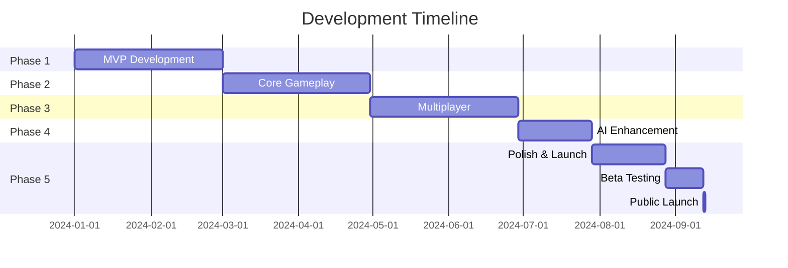

# Exit the Rat Race - Financial Education Game
## Comprehensive Project Structure Plan

### 📋 Project Overview

**Project Name:** Exit the Rat Race - AI-Powered Financial Education Game  
**Target Audience:** Young professionals (25-40) seeking financial literacy  
**Platform:** Web-based (Mobile responsive)  
**Core Technology:** React/Next.js + AI Integration  
**Estimated Development Time:** 6 months  

---

## 🎮 Game Concept

### Core Mechanics
- **Starting Age:** 25 years old
- **Maximum Rounds:** 55 rounds (representing ages 25-80)
- **Victory Condition:** Achieve financial freedom (passive income > expenses) before retirement
- **Learning Objective:** Teach real-world financial planning through gameplay

### Life Phase System
```
Phase 1: Young Adult (25-35) - 10 rounds
- Focus: Career building, debt management
- Opportunities: Education, startup, career growth
- Challenges: Student loans, low capital

Phase 2: Mid-Life (36-50) - 15 rounds  
- Focus: Wealth accumulation, family planning
- Opportunities: Real estate, business expansion
- Challenges: Family expenses, children's education

Phase 3: Pre-Retirement (51-65) - 15 rounds
- Focus: Passive income, risk management
- Opportunities: Dividend investing, consultancy
- Challenges: Health costs, aging parents

Phase 4: Retirement (66-80) - 15 rounds
- Focus: Wealth preservation, legacy planning
- Opportunities: Trust funds, estate planning
- Challenges: Medical bills, fixed income
```

---

## 🏗️ Technical Architecture

### Frontend Stack
```yaml
Framework: Next.js 14+
UI Library: React 18
Styling: Tailwind CSS
State Management: Zustand
Animations: Framer Motion
Charts: Recharts + D3.js
Forms: React Hook Form + Zod
Real-time: Supabase Realtime
Build Tool: Vite/Turbopack
Testing: Jest + React Testing Library
```

### Backend Stack
```yaml
Database: Supabase (PostgreSQL)
Authentication: Supabase Auth
Real-time: Supabase Realtime Channels
File Storage: Supabase Storage
Edge Functions: Vercel Edge Functions
AI Integration: OpenAI/Anthropic API
Caching: Redis (Upstash)
Analytics: Vercel Analytics
Monitoring: Sentry
```

### AI Services
```yaml
Content Generation: GPT-4/Claude API
Market Simulation: Custom AI model
Player Coaching: Streaming AI responses
Analysis Engine: AI-powered insights
Scenario Generator: Dynamic event creation
```

---

## 📁 Project Structure

```
exit-the-rat-race/
├── apps/
│   ├── web/                    # Main game application
│   │   ├── src/
│   │   │   ├── app/            # Next.js app router
│   │   │   │   ├── game/       # Game pages
│   │   │   │   ├── lobby/      # Multiplayer lobby
│   │   │   │   ├── profile/    # User profile
│   │   │   │   └── api/        # API routes
│   │   │   ├── components/
│   │   │   │   ├── game/       # Game components
│   │   │   │   ├── ui/         # Shared UI components
│   │   │   │   └── charts/     # Financial visualizations
│   │   │   ├── hooks/          # Custom React hooks
│   │   │   ├── lib/            # Utilities
│   │   │   ├── store/          # Zustand stores
│   │   │   └── types/          # TypeScript types
│   │   └── public/             # Static assets
│   └── admin/                  # Admin dashboard
├── packages/
│   ├── game-engine/            # Core game logic
│   │   ├── src/
│   │   │   ├── mechanics/      # Game mechanics
│   │   │   ├── ai/            # AI integration
│   │   │   ├── events/         # Event system
│   │   │   └── scoring/        # Scoring logic
│   ├── database/              # Database schemas
│   ├── ui/                    # Shared UI library
│   └── config/                # Shared configuration
├── infrastructure/
│   ├── docker/                # Docker configs
│   └── terraform/             # Infrastructure as code
└── docs/                      # Documentation
```

---

## 🗄️ Data Models

### Core Entities

```typescript
// User Profile
interface User {
  id: string
  email: string
  username: string
  avatar?: string
  stats: PlayerStats
  preferences: UserPreferences
  achievements: Achievement[]
  subscription: SubscriptionTier
  createdAt: Date
}

// Game Session
interface GameSession {
  id: string
  mode: 'single' | 'competitive' | 'cooperative' | 'mentor'
  players: PlayerSession[]
  currentRound: number
  maxRounds: number
  marketState: MarketState
  gameEvents: GameEvent[]
  status: 'waiting' | 'active' | 'paused' | 'completed'
  createdAt: Date
  completedAt?: Date
}

// Player Game State
interface PlayerSession {
  id: string
  userId: string
  sessionId: string
  character: Character
  currentAge: number
  finances: {
    cashOnHand: number
    monthlyIncome: number
    monthlyExpenses: number
    passiveIncome: number
    netWorth: number
  }
  assets: Asset[]
  liabilities: Liability[]
  decisions: Decision[]
  isRetired: boolean
  retirementAge?: number
}

// Investment Types
interface Investment {
  id: string
  type: 'stock' | 'realEstate' | 'business' | 'crypto' | 'bonds'
  name: string
  purchasePrice: number
  currentValue: number
  monthlyIncome: number
  risk: RiskLevel
  liquidityDays: number
  purchaseRound: number
}

// Game Events
interface GameEvent {
  id: string
  round: number
  type: 'market' | 'personal' | 'opportunity' | 'crisis'
  severity: 'minor' | 'moderate' | 'major'
  title: string
  description: string
  choices: Choice[]
  aiGenerated: boolean
  educationalContent?: string
}
```

---

## 🎯 Feature Breakdown

### Phase 1: MVP (Months 1-2)
- [ ] User authentication & profiles
- [ ] Character creation (profession selection)
- [ ] Basic game loop (income/expenses)
- [ ] Simple investments (stocks, savings)
- [ ] Age progression system
- [ ] Win/lose conditions
- [ ] Basic UI/UX

### Phase 2: Core Gameplay (Months 2-3)
- [ ] Advanced investments (real estate, business)
- [ ] Market events system
- [ ] Life events (marriage, children, health)
- [ ] AI event generation
- [ ] Financial education tooltips
- [ ] Achievement system
- [ ] Save/load game state

### Phase 3: Multiplayer (Months 3-4)
- [ ] Real-time multiplayer infrastructure
- [ ] Lobby system
- [ ] Competitive mode
- [ ] Cooperative mode
- [ ] Turn timers
- [ ] Player interactions
- [ ] Spectator mode

### Phase 4: AI Enhancement (Months 4-5)
- [ ] Dynamic market simulation
- [ ] Personalized coaching
- [ ] Scenario generator
- [ ] Post-game analysis
- [ ] Learning path recommendations
- [ ] Natural language explanations
- [ ] Adaptive difficulty

### Phase 5: Polish & Launch (Months 5-6)
- [ ] Mobile optimization
- [ ] Performance optimization
- [ ] Tutorial system
- [ ] Onboarding flow
- [ ] Payment integration
- [ ] Marketing website
- [ ] Analytics setup
- [ ] Beta testing

---

## 💰 Monetization Strategy

### Subscription Tiers

```yaml
Free Tier:
  - 3 games per day
  - Basic professions
  - Limited AI coaching
  - Standard events

Basic ($9.99/month):
  - Unlimited games
  - All professions
  - AI coaching
  - Custom scenarios
  - Multiplayer access

Pro ($19.99/month):
  - Everything in Basic
  - Advanced analytics
  - Tournament access
  - Custom private rooms
  - Priority AI processing
  - Exclusive events

Educational ($99/month):
  - Bulk licenses (up to 30 users)
  - Admin dashboard
  - Progress tracking
  - Custom branding
  - Curriculum integration
```

---

## 🚀 Development Workflow

### Sprint Structure (2-week sprints)

```
Week 1:
- Monday-Tuesday: Planning & design
- Wednesday-Friday: Core development

Week 2:
- Monday-Wednesday: Development & testing
- Thursday: Code review & integration
- Friday: Demo & retrospective
```

### Git Workflow

```bash
main
├── develop
│   ├── feature/game-mechanics
│   ├── feature/multiplayer
│   ├── feature/ai-integration
│   └── feature/ui-components
└── release/v1.0.0
```

### CI/CD Pipeline

```yaml
Pipeline:
  1. Lint & Format: ESLint, Prettier
  2. Type Check: TypeScript
  3. Unit Tests: Jest
  4. Integration Tests: Playwright
  5. Build: Next.js production build
  6. Deploy: Vercel/Netlify
  7. Monitor: Sentry error tracking
```

---

## 🎨 UI/UX Design System

### Design Principles
1. **Clarity:** Financial data must be instantly understandable
2. **Engagement:** Game-like feel without sacrificing education
3. **Accessibility:** WCAG 2.1 AA compliance
4. **Responsiveness:** Mobile-first approach

### Component Library

```typescript
Core Components:
- GameBoard: Main game interface
- FinancialDashboard: Income/expense tracker
- InvestmentPortfolio: Asset management
- MarketTicker: Real-time market updates
- DecisionModal: Choice interface
- PlayerAvatar: Character representation
- ProgressBar: Life/retirement progress
- Leaderboard: Competitive rankings
```

### Color Palette

```css
:root {
  /* Primary - Financial Success */
  --success-green: #10B981;
  --wealth-gold: #F59E0B;
  
  /* Game States */
  --rat-race: #6B7280;
  --fast-track: #8B5CF6;
  
  /* Alerts */
  --opportunity: #3B82F6;
  --crisis: #EF4444;
  
  /* UI Base */
  --background: #111827;
  --surface: #1F2937;
  --text-primary: #F9FAFB;
}
```

---

## 🧪 Testing Strategy

### Test Coverage Goals
- Unit Tests: 80% coverage
- Integration Tests: Critical user paths
- E2E Tests: Main game flows
- Performance Tests: <3s initial load

### Test Categories

```javascript
// Unit Tests
- Game mechanics calculations
- Financial formulas
- State management
- Utility functions

// Integration Tests  
- API endpoints
- Database operations
- Real-time synchronization
- AI integrations

// E2E Tests
- Complete game session
- Multiplayer lobby → game → results
- Payment flow
- Onboarding process
```

---

## 📊 Analytics & Metrics

### Key Performance Indicators (KPIs)

```yaml
User Engagement:
  - Daily Active Users (DAU)
  - Session duration
  - Games completed per user
  - Tutorial completion rate

Learning Metrics:
  - Concept comprehension scores
  - Decision improvement over time
  - Achievement unlock rate
  - Post-game quiz scores

Business Metrics:
  - Conversion rate (free → paid)
  - Monthly Recurring Revenue (MRR)
  - Churn rate
  - Customer Lifetime Value (CLV)

Game Balance:
  - Average retirement age
  - Win rate by profession
  - Most used strategies
  - AI event effectiveness
```

---

## 🔒 Security & Compliance

### Security Measures
- JWT authentication
- Rate limiting on API endpoints
- Input validation and sanitization
- SQL injection prevention
- XSS protection
- HTTPS enforcement

### Data Privacy
- GDPR compliance
- User data encryption
- Secure payment processing (Stripe)
- Privacy policy and terms of service
- Data export functionality

---

## 📈 Scaling Considerations

### Performance Optimization
- Code splitting
- Lazy loading
- Image optimization
- CDN deployment
- Database indexing
- Caching strategy

### Infrastructure Scaling
- Auto-scaling game servers
- Database read replicas
- Queue system for AI requests
- WebSocket connection pooling
- Microservices architecture (future)

---

## 🌍 Localization Plan

### Initial Markets
1. **English** (Global)
2. **Bahasa Malaysia** (Malaysia)
3. **Mandarin Chinese** (Singapore, Malaysia)
4. **Bahasa Indonesia** (Indonesia)

### Localization Scope
- UI text translation
- Currency conversion
- Local investment types
- Cultural contextualization
- Regional tax implications

---

## 📝 Documentation Requirements

### Developer Documentation
- API documentation (OpenAPI/Swagger)
- Component storybook
- Architecture decision records
- Deployment guides
- Contributing guidelines

### User Documentation  
- Game rules and mechanics
- Strategy guides
- Video tutorials
- FAQ section
- Community forum

---

## 🎯 Success Criteria

### Launch Goals (Month 6)
- 1,000 registered users
- 100 paying subscribers
- 4.0+ app store rating
- 70% tutorial completion
- 50% day-7 retention

### Year 1 Goals
- 10,000 registered users
- 1,000 paying subscribers
- Educational partnerships (5 institutions)
- Mobile app launch
- International expansion (3 countries)

---

## 📅 Timeline & Milestones



---

## 🤝 Team Requirements

### Core Team
- **Project Lead** (You)
- **Frontend Developer** (React/Next.js)
- **Backend Developer** (Node.js/Supabase)
- **UI/UX Designer**
- **AI/ML Engineer** (part-time)
- **QA Tester** (contract)

### Advisory
- Financial Education Expert
- Game Design Consultant
- Marketing Specialist

---

## 📞 Contact & Resources

### Development Resources
- GitHub Repository: [github.com/yourusername/exit-the-rat-race]
- Project Board: [Trello/Notion/Linear]
- Design Files: [Figma]
- API Documentation: [Postman/Swagger]

### Community
- Discord Server: [Community discussions]
- Beta Testers Group: [Testing feedback]
- Educational Partners: [School connections]

---

*Last Updated: November 2024*
*Version: 1.0.0*